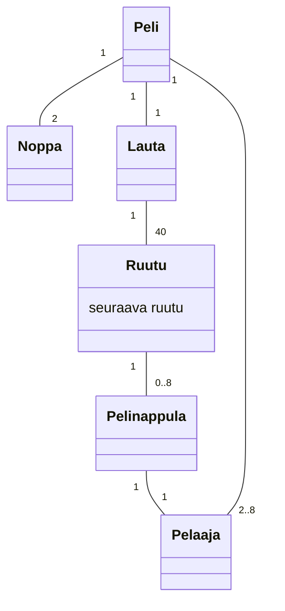
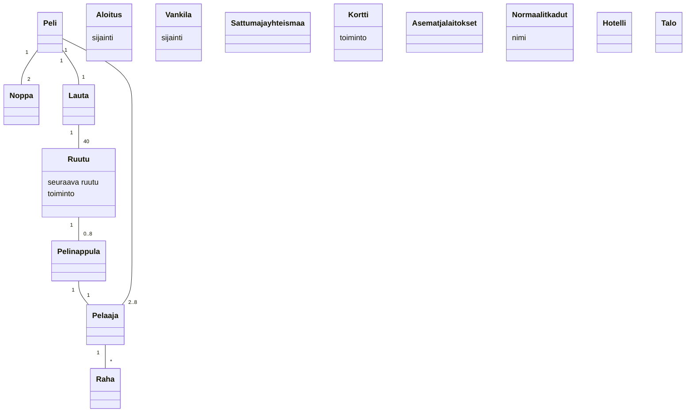

# Tehtävä 1: Monopoli

```mermaid
 classDiagram
      Peli "1"--"2" Noppa
      Peli "1"--"1" Lauta
      Lauta "1"--"40" Ruutu
      Ruutu "1"--"0..8" Pelinappula
      Pelinappula "1"--"1" Pelaaja
      Pelaaja "2..8"--"1" Peli
      class Peli{
      }
      class Lauta{
      }
      class Ruutu{
      seuraava ruutu
      }
      class Pelaaja{
      }
      class Pelinappula{
      }
      class Noppa{
      }
```

# Tehtävä 2: Monopoli

```mermaid
 classDiagram
      Peli "1"--"2" Noppa
      Peli "1"--"1" Lauta
      Lauta "1"--"40" Ruutu
      Ruutu "1"--"0..8" Pelinappula
      Pelinappula "1"--"1" Pelaaja
      Pelaaja "2..8"--"1" Peli
      Pelaaja "1"--"*" Raha
      class Peli{
      }
      class Lauta{
      }
      class Ruutu{
      seuraava ruutu
      toiminto
      }
      class Raha{
      }
      class Pelaaja{
      }
      class Pelinappula{
      }
      class Noppa{
      }
      class Aloitus{
      sijainti
      }
      class Vankila{
      sijainti
      }
      class Sattuma ja yhteismaa{
      }
      class Kortti{
      toiminto
      }
      class Asemat ja laitokset{
      }
      class Normaalit kadut{
      nimi
      }
      class Hotelli{
      }
      class Talo{
      }
```
