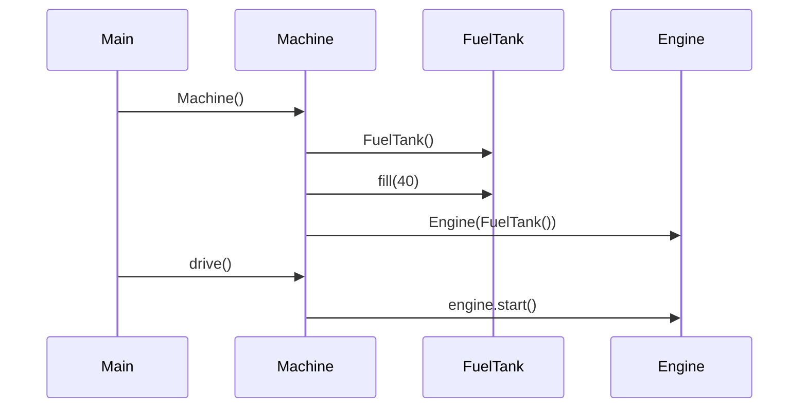

# Tehtävä 3 Sekvenssikaavio

```mermaid
 sequenceDiagram
   participant P as Main
   participant M as Machine
   participant F as FuelTank
   participant E as Engine
   P->>M: Machine()
   M->>F: FuelTank()
   M->>F: fill(40)
   M->>E: Engine(FuelTank())
   P->>M: drive()
   M->>E: engine.start()
   
```
