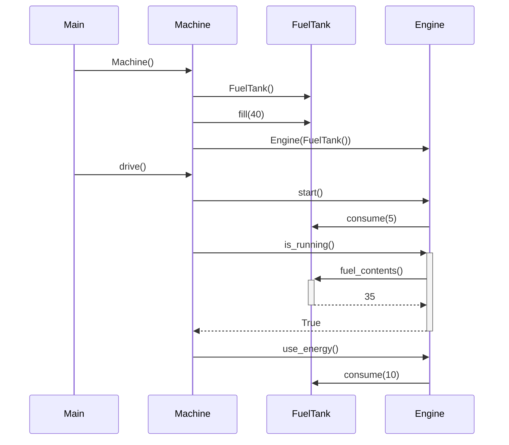
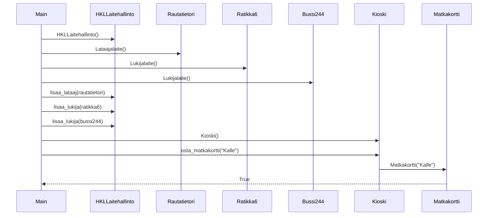

# Tehtävä 3 Sekvenssikaavio

```mermaid
 sequenceDiagram
   participant P as Main
   participant M as Machine
   participant F as FuelTank
   participant E as Engine
   P->>M: Machine()
   M->>F: FuelTank()
   M->>F: fill(40)
   M->>E: Engine(FuelTank())
   P->>M: drive()
   M->>E: start()
   E->>F: consume(5)
   M->>+E: is_running()
   E->>+F:fuel_contents()
   F-->>-E: 35
   E-->>-M: True
   M->>E: use_energy()
   E->>F: consume(10)

```

# Tehtävä 4 Laajempi sekvenssikaavio

```mermaid
  sequenceDiagram
      participant M as Main
      participant H as HKLLaitehallinto
      participant L as Rautatietori
      participant R as Ratikka6
      participant B as Bussi244
      participant K as Kioski
      participant A as Matkakortti
      
      M->>H: HKLLaitehallinto()
      M->>L: Lataajalaite()
      M->>R: Lukijalaite()
      M->>B: Lukijalaite()
      M->>H: lisaa_lataaj(rautatietori)
      M->>H: lisaa_lukija(ratikka6)
      M->>H: lisaa_lukija(bussi244)
      M->>K: Kioski()
      M->>K: osta_matkakortti("Kalle")
      K->>A: Matkakortti("Kalle")
      A-->>M: True
```
