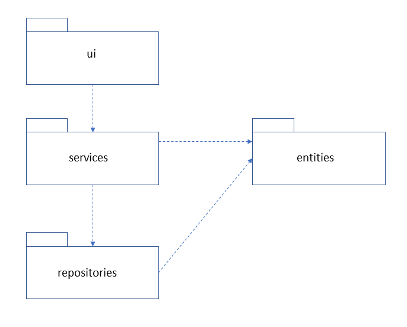
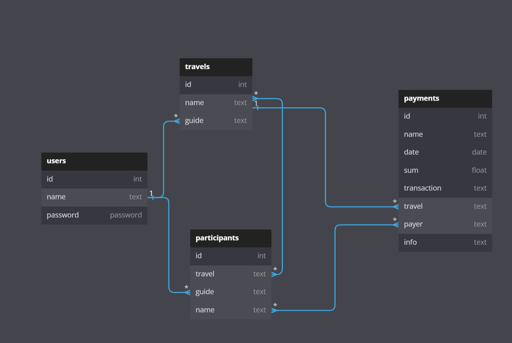
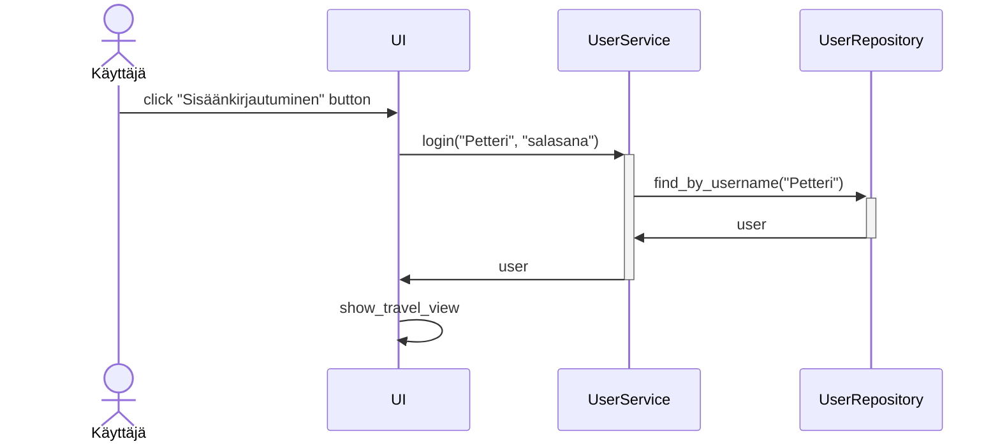
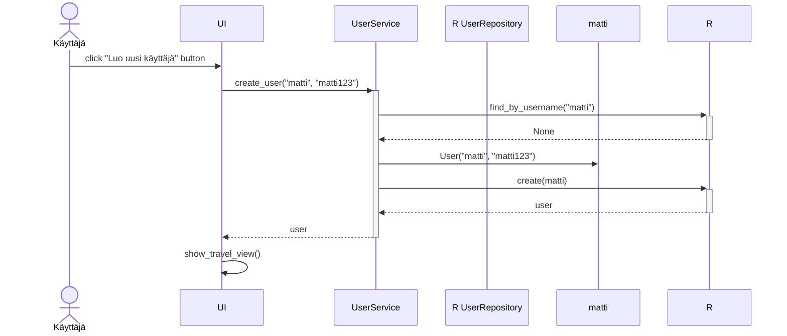
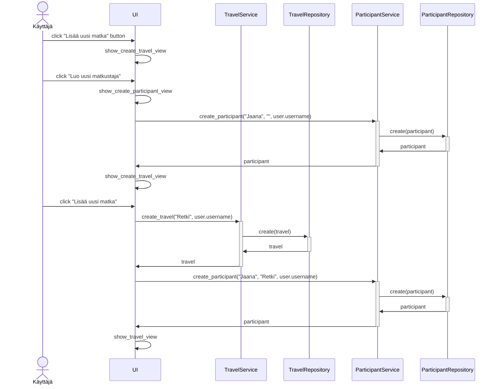

# Arkkitehtuurikuvaus

### Rakenne

Ohjelman rakenne noudattelee kolmitasoista kerrosarkkitehtuuria, ja koodin pakkausrakenne on seuraava:

Pakkaus ui sisältää käyttöliittymästä, services sovelluslogiikasta ja repositories tietojen pysyväistallennuksesta vastaavan koodin. Pakkaus entities sisältää luokkia, jotka kuvastavat sovelluksen käyttämiä tietokohteita.

### Tietokantaskeema

Ohjelman tietokantaskeema on seuraava:

### Päätoiminnallisuudet

Ohjelman päätoiminnallisuudet sekvenssikaavioina:

#### Käyttäjän kirjautuminen sisään

Kun kirjautumisnäkymän syötekenttiin kirjoitetetataan käyttäjätunnus ja salasana, jonka jälkeen klikataan painiketta Sisäänkirjautuminen, etenee sovelluksen kontrolli seuraavasti:

Sisäänkirjautuminen-painikkeen painamiseen reagoiva tapahtumankäsittelijä kutsuu sovelluslogiikan TUserService metodia login antaen parametriksi käyttäjätunnuksen ja salasanan. Sovelluslogiikka selvittää UserRepository:n avulla onko käyttäjätunnus olemassa. Jos on, tarkastetaan täsmääkö salasanat. Jos salasanat täsmäävät, kirjautuminen onnistuu. Tämän seurauksena käyttöliittymä vaihtaa näkymäksi ShowTravelView, eli sovelluksen varsinaisen päänäkymän ja listaa näkymään kirjautuneen käyttäjän tallennetut matkat.

#### Uuden käyttäjän luominen

Kun uuden käyttäjän luomisnäkymässä on syötetty käyttäjätunnus, joka ei ole jo käytössä sekä salasana, jonka jälkeen klikataan Luo uusi käyttäjä -painiketta etenee sovelluksen kontrolli seuraavasti:

[Tapahtumakäsittelijä](https://github.com/ohjelmistotekniikka-hy/python-todo-app/blob/master/src/ui/create_user_view.py#L18) kutsuu sovelluslogiikan metodia [create_user](https://github.com/ohjelmistotekniikka-hy/python-todo-app/blob/master/src/services/todo_service.py#L130) antaen parametriksi luotavan käyttäjän tiedot. Sovelluslogiikka selvittää `UserRepository`:n avulla onko käyttäjätunnus olemassa. Jos ei, eli uuden käyttäjän luominen on mahdollista, luo sovelluslogiikka `User`-olion ja tallettaa sen kutsumalla `UserRepository`:n metodia `create`. Tästä seurauksena on se, että käyttöliittymä vaihtaa näkymäksi `ShowTravelView`:n. Luotu käyttäjä kirjataan automaattisesti sisään.

#### Uuden matkan luominen

Kun sisäänkirjautunut käyttäjä luo uuden matkan, niin sovelluksen kontrolli etenee seuraavasti:

Lisää uusi matka -painikkeen painamiseen reagoiva tapahtumankäsittelijä vaihtaa näkymäksi CreateTravelView. Näkymässä kirjautunut käyttäjä voi antaa uudelle matkalle nimen sekä valita matkan matkustajat. Aluksi matkustajaluettelossa on vain sisäänkirjautunut käyttäjä. Uusia matkustajia voi lisätä matkustajaluetteloon Luo uusi matkustaja -painiketta painamalla. Painikkeen painamiseen reagoiva tapahtumakäsittelijä vaihtaa näkymäksi CreateParticipantView. CreateParticipantView-näkymässä painamalla Luo uusi matkustaja -painiketta sen tapahtumakäsittelijä kutsuu sovelluslogiikan ParticipantService metodia create_participant. Parametriksi annetaan matkustajan nimi. Sovelluslogiikka selvittää ParticipantRepository:n avulla onko nimi jo tallennettu sisäänkirjautuneen käyttäjän nimellä. Jos ei ole, niin uuden matkustajan tallentaminen onnistuu. Tämän seurauksena käyttöliittymä vaihtaa näkymäksi takaisin CreateTravelView:n, eli uuden matkan luominen -näkymän. Käyttäjä voi tallentaa uuden matkan Lisää uusi matka -painiketta painamalla. Painikkeen painamiseen reagoiva tapahtumakäsittelijä kutsuu sovelluslogiikan TravelService metodia create_travel, jonka parametreina ovat matkan nimi ja matkustajaluettelosta valitut matkustajat. Sovelluslogiikka selvittää TravelRepository:n avulla onko matkan nimi jo tallennettu sisäänkirjautuneen käyttäjän nimellä. Jos ei ole, niin uuden matkan tallentaminen onnistuu. Samalla jokainen valittu matkustaja tallennettaan tietokantaan matkan nimen ja sisäänkirjautuneen käyttäjän nimellä. Lopuksi käyttöliittymä vaihtaa näkymäski päänäkymän ShowTravelView.
