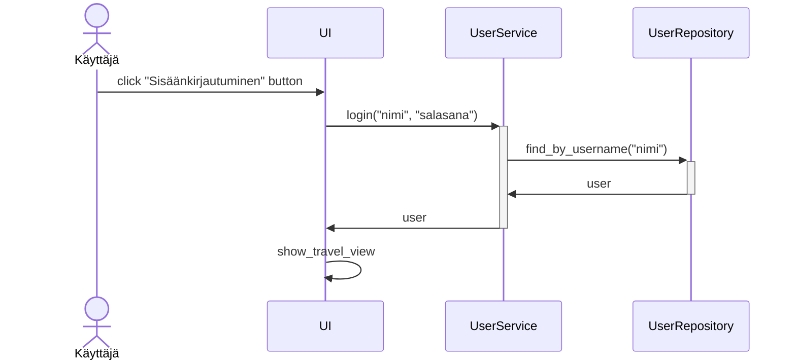
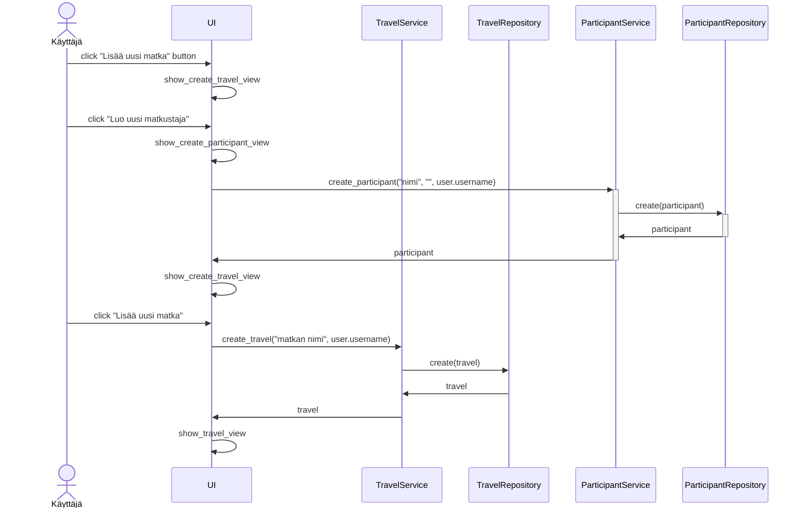

# Arkkitehtuurikuvaus

### Rakenne

Ohjelman rakenne noudattelee kolmitasoista kerrosarkkitehtuuria, ja koodin pakkausrakenne on seuraava:

Pakkaus ui sisältää käyttöliittymästä, services sovelluslogiikasta ja repositories tietojen pysyväistallennuksesta vastaavan koodin. Pakkaus entities sisältää luokkia, jotka kuvastavat sovelluksen käyttämiä tietokohteita.

### Tietokantaskeema

Ohjelman tietokantaskeema on seuraava:

### Päätoiminnallisuudet

Ohjelman päätoiminnallisuudet sekvenssikaavioina:

#### Käyttäjän kirjautuminen sisään

Kun kirjautumisnäkymän syötekenttiin kirjoitetetataan käyttäjätunnus ja salasana, jonka jälkeen klikataan painiketta Sisäänkirjautuminen, etenee sovelluksen kontrolli seuraavasti:

#### Uuden matkan luominen

Kun sisäänkirjautunut käyttäjä luo uuden matkan, niin sovelluksen kontrolli etenee seuraavasti:

