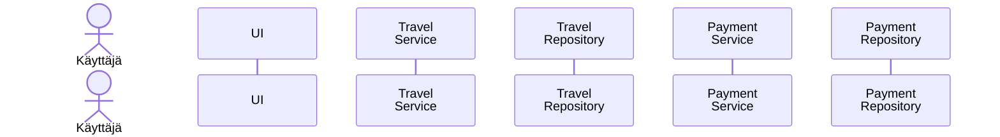

# Arkkitehtuurikuvaus

### Rakenne

Ohjelman rakenne noudattelee kolmitasoista kerrosarkkitehtuuria, ja koodin pakkausrakenne on seuraava:

Pakkaus ui sisältää käyttöliittymästä, services sovelluslogiikasta ja repositories tietojen pysyväistallennuksesta vastaavan koodin. Pakkaus entities sisältää luokkia, jotka kuvastavat sovelluksen käyttämiä tietokohteita.

### Tietokantaskeema

Ohjelman tietokantaskeema on seuraava:

### Hakemistorakenne

Ohjelman rakenne on hajautettu ja eri osat on tallennettu seuraavasti:

- tietomallit on tallennettu kansioon `entities`
- tietojen tallennuksesta vastaavat luokat on tallennettu kansioon `repositories`
- sovelluslogiikasta vastaavat luokat on tallennettu kansioon `services`
- käyttöliittymästä vastaavat luokat on tallennettu kansioon `ui`
- testit on tallennettu kansioon `tests`

### Käyttöliittymä

Käyttöliittymä sisältää yhdeksän erillistä näkymää:

- Sisäänkirjautuminen
- Uuden käyttäjän luominen
- Matkaluettelo
- Uuden matkan luominen
- Uuden matkustajan luominen
- Matkan laskuluettelo
- Uuden matkan luominen
- Yksittäisen laskun tiedot
- Yhteenveto

Jokainen näistä on toteutettu omana luokkanaan. Näkymistä yksi on aina kerrallaan näkyvänä. Näkymien näyttämisestä vastaa UI-luokka. Käyttöliittymä on pyritty eristämään täysin sovelluslogiikasta. Se ainoastaan kutsuu eri Service-luokkien metodeja.

### Sovelluslogiikka

Sovelluksen loogisen tietomallin muodostavat luokat [User](https://github.com/phuvio/ot-harjoitustyo/blob/main/travel-expense-calculator-app/src/entities/user.py), [Travel](https://github.com/phuvio/ot-harjoitustyo/blob/main/travel-expense-calculator-app/src/entities/travel.py), [Participant](https://github.com/phuvio/ot-harjoitustyo/blob/main/travel-expense-calculator-app/src/entities/participant.py) ja [Payment](https://github.com/phuvio/ot-harjoitustyo/blob/main/travel-expense-calculator-app/src/entities/payment.py). User-luokka kuvaa käyttäjiä, Travel-luokka matkoja, Participant-luokka matkoille osallistuvia matkustajia ja Payment-luokka maksuja.

### Tietojen pysyväistallennus

Repositories luokat `UserRepository`, `TravelRepository`, `ParticipantRepository` ja `PaymentRepository` huolehtivat tietojen tallettamisesta. Tiedot tallennetaan SQLite-tietokantaan.

Luokat noudattavat Repository-suunnittelumallia ja ne on tarvittaessa mahdollista korvata uusilla toteutuksilla, jos sovelluksen datan talletustapaa päätetään vaihtaa. 

#### Tiedostot

Sovellus tallettaa SQLite-tietokannan kansioon `data`.

Sovelluksen juureen sijoitettu konfiguraatiotiedosto .env määrittelee tiedoston nimen, joka on nyt `travelexpenses.db`. Käyttäjät tallennetaan tietokannan tauluun `users`, matkat tauluun `travels`, matkustajat tauluun `participants` ja maksut tauluun `payments`. Taulut alustetaan tiedostossa `initialize_database.py`.

### Päätoiminnallisuudet

Ohjelman päätoiminnallisuudet sekvenssikaavioina:

#### Käyttäjän kirjautuminen sisään

Kun kirjautumisnäkymän syötekenttiin kirjoitetetataan käyttäjätunnus ja salasana, jonka jälkeen klikataan painiketta Sisäänkirjautuminen, etenee sovelluksen kontrolli seuraavasti:

Sisäänkirjautuminen-painikkeen painamiseen reagoiva tapahtumankäsittelijä kutsuu sovelluslogiikan `UserService` metodia `login` antaen parametriksi käyttäjätunnuksen ja salasanan. Sovelluslogiikka selvittää `UserRepository`:n avulla onko käyttäjätunnus olemassa. Jos on, tarkastetaan täsmääkö salasanat. Jos salasanat täsmäävät, kirjautuminen onnistuu. Tämän seurauksena käyttöliittymä vaihtaa näkymäksi `ShowTravelView`, eli sovelluksen varsinaisen päänäkymän ja listaa näkymään kirjautuneen käyttäjän tallennetut matkat.

#### Uuden käyttäjän luominen

Kun uuden käyttäjän luomisnäkymässä on syötetty käyttäjätunnus, joka ei ole jo käytössä sekä salasana, jonka jälkeen klikataan Luo uusi käyttäjä -painiketta etenee sovelluksen kontrolli seuraavasti:

[Tapahtumakäsittelijä](https://github.com/phuvio/ot-harjoitustyo/blob/main/travel-expense-calculator-app/src/ui/ui.py#L65) kutsuu sovelluslogiikan metodia [create_user](https://github.com/phuvio/ot-harjoitustyo/blob/main/travel-expense-calculator-app/src/services/user_service.py#L28) antaen parametriksi luotavan käyttäjän tiedot. Sovelluslogiikka selvittää `UserRepository`:n avulla onko käyttäjätunnus olemassa. Jos ei, eli uuden käyttäjän luominen on mahdollista, luo sovelluslogiikka `User`-olion ja tallettaa sen kutsumalla `UserRepository`:n metodia `create`. Tästä seurauksena on se, että käyttöliittymä vaihtaa näkymäksi `ShowTravelView`:n. Luotu käyttäjä kirjataan automaattisesti sisään.

#### Uuden matkan luominen

Kun sisäänkirjautunut käyttäjä luo uuden matkan, niin sovelluksen kontrolli etenee seuraavasti:

`Lisää uusi matka` -painikkeen painamiseen reagoiva tapahtumankäsittelijä vaihtaa näkymäksi `CreateTravelView`. Näkymässä kirjautunut käyttäjä voi antaa uudelle matkalle nimen sekä valita matkan matkustajat. Aluksi matkustajaluettelossa on vain sisäänkirjautunut käyttäjä. 

Uusia matkustajia voi lisätä matkustajaluetteloon Luo uusi matkustaja -painiketta painamalla. Painikkeen painamiseen reagoiva tapahtumakäsittelijä vaihtaa näkymäksi `CreateParticipantView`. `CreateParticipantView`-näkymässä painamalla `Luo uusi matkustaja` -painiketta sen tapahtumakäsittelijä kutsuu sovelluslogiikan `ParticipantService` metodia `get_participants_by_guide`, joka etsii sisäänkirjautuneen käyttäjän tallentamat matkustajat. Metodi kutsuu `ParticipantRepository`:n metodia `find_by_guide`, joka palauttaa luettelon sisäänkirjautuneen käyttäjän tallentamista matkustajista `Participant`-olioina. Sovelluslogiikka tarkastaa onko luettelossa annettu matkustajan nimi. Mikäli ei ole, niin painikkeen tapahtumakäsittelijä kutsuu `ParticipantService`:n metodia `create_participant`. Parametreiksi annetaan matkustajan nimi, matkan nimeksi \*-merkki sekä sisäänkirjautuneen käyttäjän `username`. Metodi kutsuu `ParticipantRepository`:n metodia `create`, jolle annetaan parametriksi `Participant`-olio. Molemmat metodit palauttavat tallennetun `Participant`-olion. Lopuksi sovelluslogiikka vaihtaa näkymäksi takaisin `CreateTravelView`:n, eli uuden matkan luominen -näkymän. 

Käyttäjä voi tallentaa uuden matkan `Lisää uusi matka` -painiketta painamalla. Painikkeen painamiseen reagoiva tapahtumakäsittelijä kutsuu sovelluslogiikan `TravelService` metodia `create_travel`, jonka parametreina ovat matkan nimi ja sisäänkirjautuneen käyttäjän `username`. Sovelluslogiikka yrittää tallentaa matkaa kutsumalla `TravelRepository`:n metodia `create`, jonka parametriksi annetaan sovelluslogiikan luoma `Travel`-olio. Mikäli tallennus onnistuu eli tietokannasta ei löyty sisäänkirjautuneen käyttäjän nimellä tallennettua saman nimistä matkaa, niin sen jälkeen sovelluslogiikka tallentaa jokaisen matkustajaluettelosta valitun matkustajat tietokantaan matkan nimen ja sisäänkirjautuneen käyttäjän nimellä kutsumalla `ParticipantService`:n metodia `create_participant`. Lopuksi sovelluslogiikka vaihtaa näkymäksi päänäkymän `ShowTravelView`.

#### Uuden maksun luominen

