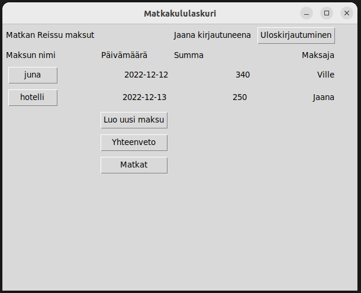
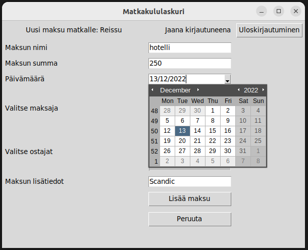
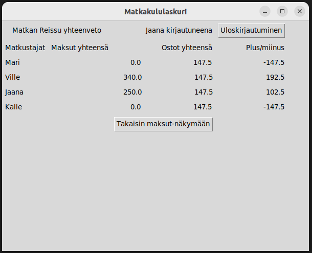

# Käyttöohje

Työn alla

## Konfigurointi

Työn alla

## Ohjelman käynnistäminen

Työn alla

## Kirjautuminen

Sovellus käynnistyy sisäänkirjautumisnäkymään:

Sisäänkirjautuminen onnistuu aikaisemmin luodulla käyttäjätunnuksella ja salasanalla. Syötä käyttäjätunnus ja salasana niille varattuihin kenttiin ja paina "Sisäänkirjaus"-painiketta.

## Uuden käyttäjän luominen

Sisäänkirjautumisnäkymästä on mahdollista siirtyä Luo uusi käyttäjä -näkymään painamalla "Lisää käyttäjä" -painiketta.

Uusi käyttäjä luodaan syöttämällä tiedot syötekenttiin ja painamalla "Luo uusi käyttäjä" -painiketta:

Uuden käyttäjätunnuksen ja salasanan on oltava vähintään kolmen merkin pituisia. Lisäksi käyttäjätunnukseksi ei voi valita jo aikaisemmin tallennettua käyttäjätunnusta.

Mikäli uuden käyttäjätunnuksen luominen onnistuu, siirtyy ohjelma suoraan Matkat-näkymään.

## Matkat-näkymä

Sisäänkirjautumisen jälkeen avautuu Matkat-näkymä. Aluksi näkymä ilmoittaa, että tallennettuja matkoja ei löydy. Kun matkoja on lisätty, näkymä näyttää luettelona jokaisen matkan nimen ja matkustajat:

"Lisää uusi matka" -painiketta painamalla voi siirtyä luomaan uusia matkoja. Painamalla matkan nimeä voi siirtyä näkymään, joka näyttää kyseisen matkan tiedot.

Sisäänkirjautunut käyttäjä voi kirjautua ulos painamalla "uloskirjautuminen"-nappia, jolloin siirrytään sisäänkirjautumisnäkymään.

## Uuden matkan luominen

Uudelle matkalle annetaan nimi sekä valitaan matkustajat. Aluksi, kun matkustajia ei ole vielä luotu, matkustajavalikossa näkyy vain sisäänkirjautuneen käyttäjän käyttäjätunnus. Uusi matkustajia voi luoda painamalla "Luo uusi matkustaja" -nappia, jolloin siirrytään "luo uusi matkustaja" -näkymään. Jokainen uusi matkustaja tulee näkyviin "valitse matkustajat" -valikkoon, josta voi valita matkan matkustajat. Kun halutut matkustajat on valittu, painamalla "luo uusi matka" -nappia luodaan uusi matka ja samalla palataan "matkat"-näkymään. 

Uuden matkan luomisen voi peruuttaa painamalla "peruuta"-nappia, jolloin palataan takaisin "matkat"-näkymään.

Sisäänkirjautunut käyttäjä voi kirjautua ulos painamalla "uloskirjautuminen"-nappia, jolloin siirrytään sisäänkirjautumisnäkymään.

## Uuden matkustajan luominen

Uuden matkustajan luominen onnistuu syöttämällä matkustajan nimi syötekenttään ja painamalla "luo uusi matkustaja" -painiketta. Silloin siirrytään automaattisesti "uuden matkan luominen" -näkymään. Uuden matkustajan nimen täytyy olla vähintää 3 merkin pituinen ja se ei saa olla sama kuin aiemmin tallennettu matkustajan nimi.

Uuden matkustajan luomisen voi peruuttaa painamalla "peruuta"-nappia, jolloin palataan takaisin "luo uusi matka" -näkymään.

Sisäänkirjautunut käyttäjä voi kirjautua ulos painamalla "uloskirjautuminen"-nappia, jolloin siirrytään sisäänkirjautumisnäkymään.

## Matkan maksut

Kun matkat-näkymässä on painettu halutun matkan nimeä, niin valitun matkan maksuluettelo tulee näkyviin. Aluksi luettelossa ei ole maksuja. Uuden maksun voi luoda painamalla "luo uusi maksu" -painiketta. Silloin näkymäksi tulee "uuden maksun luominen" -näkymä. Kun maksujan on luotu, ne näkyvät luettelossa. Jokaisesta luodusta maksusta näkyy matkan nimi, päivämäärä, summa ja maksaja. Painamalla maksun nimeä siirrytään "maksun tiedot" -näkymään, jossa näkyy kyseisen maksun kaikki tiedot. 

Painamalla "yhteenveto"-nappulaa siirrytään yhteenveto-näkymään, jossa on yhteenveto matkan osallistujien maksuista ja ostoista.

Painamalla "matkat"-nappulaan siirrytään matkat-näkymään.

Sisäänkirjautunut käyttäjä voi kirjautua ulos painamalla "uloskirjautuminen"-nappia, jolloin siirrytään sisäänkirjautumisnäkymään.

## Uuden maksun luominen

Uuden maksun luominen onnistuu syöttämällä vaaditut tiedot syötekenttiin. Maksulle pitää antaa nimi, joka on vähintään 3 merkin pituinen. Sille pitää antaa summa ja päivämäärä. Lisäksi pitää valita yksi maksaja ja yksi tai useampi ostaja. Maksaja on henkilö, joka on maksanut maksun. Ostajat ovat henkilöitä, joille maksu kohdistuu. Maksulle voi antaa myös lisätietoja, mutta tämä ei ole pakollista. Uusi maksu luodaan painamalla "lisää maksu" -painiketta, jolloin palataan maksuluetteloon.

Maksun päivämäärän voi valita klikkaamalla syötekenttää, jolloin aukeaa kalenteri. Kalenterista voi valita halutun päivämäärän klikkaamalla kyseistä päivää. Päivämäärän syötekenttä ehdottaa automaattisesti nykyistä päivämäärä.

Uuden maksun luomisen voi peruuttaa painamalla "peruuta"-nappia, jolloin palataan takaisin maksuluetteloon.

Sisäänkirjautunut käyttäjä voi kirjautua ulos painamalla "uloskirjautuminen"-nappia, jolloin siirrytään sisäänkirjautumisnäkymään.

## Maksun tiedot

Maksutiedot-näkymässä on näkyvissä valitun maksun kaikki tiedot. Painamalla "takaisin maksut-näkymään"-nappulaa palataan takaisin maksuluetteloon.

Sisäänkirjautunut käyttäjä voi kirjautua ulos painamalla "uloskirjautuminen"-nappia, jolloin siirrytään sisäänkirjautumisnäkymään.

## Yhteenveto

Yhteenveto-näkymässä matkan jokaisen matkustajan kohdalla on laskettu yhteen kyseisen matkustajan maksamansa maksut sekä ostokset, jotka kohdistuvat kyseiseen matkustajaan. Lisäksi jokaisen matkustajan kohdalla on plus/miinus-tilasto. Tilasto näyttää onko kyseinen matkustaja maksanut enemmän kuin osuutensa, jolloin summa on positiivinen, vai vähemmän kuin osuutensa, jolloin summa on negatiivinen. Painamalla "takaisin maksut-näkymään"-nappulaa palataan takaisin maksuluetteloon.

Sisäänkirjautunut käyttäjä voi kirjautua ulos painamalla "uloskirjautuminen"-nappia, jolloin siirrytään sisäänkirjautumisnäkymään.
