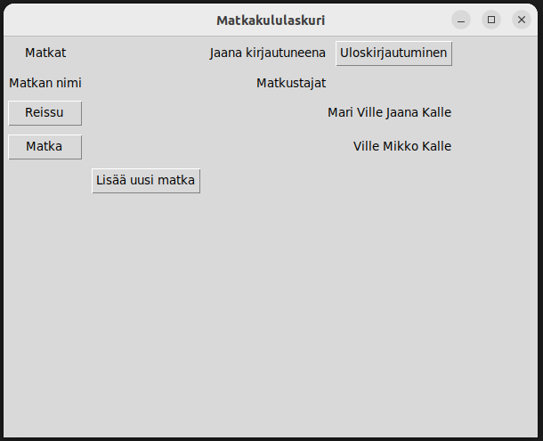

# Käyttöohje

Työn alla

## Konfigurointi

Työn alla

## Ohjelman käynnistäminen

Työn alla

## Kirjautuminen

Sovellus käynnistyy sisäänkirjautumisnäkymään:

Sisäänkirjautuminen onnistuu aikaisemmin luodulla käyttäjätunnuksella ja salasanalla. Syötä käyttäjätunnus ja salasana niille varattuihin kenttiin ja paina "Sisäänkirjaus"-painiketta.

## Uuden käyttäjän luominen

Sisäänkirjautumisnäkymästä on mahdollista siirtyä Luo uusi käyttäjä -näkymään painamalla "Lisää käyttäjä" -painiketta.

Uusi käyttäjä luodaan syöttämällä tiedot syötekenttiin ja painamalla "Luo uusi käyttäjä" -painiketta:

Uuden käyttäjätunnuksen ja salasanan on oltava vähintään kolmen merkin pituisia. Lisäksi käyttäjätunnukseksi ei voi valita jo aikaisemmin tallennettua käyttäjätunnusta.

Mikäli uuden käyttäjätunnuksen luominen onnistuu, siirtyy ohjelma suoraan Matkat-näkymään.

## Matkat-näkymä

Sisäänkirjautumisen jälkeen avautuu Matkat-näkymä. Aluksi näkymä ilmoittaa, että tallennettuja matkoja ei löydy. Kun matkoja on lisätty, näkymä näyttää luettelona jokaisen matkan nimen ja matkustajat:

"Lisää uusi matka" -painiketta painamalla voi siirtyä luomaan uusia matkoja. Painamalla matkan nimeä voi siirtyä näkymään, joka näyttää kyseisen matkan tiedot.

## Uuden matkan luominen

Työn alla
