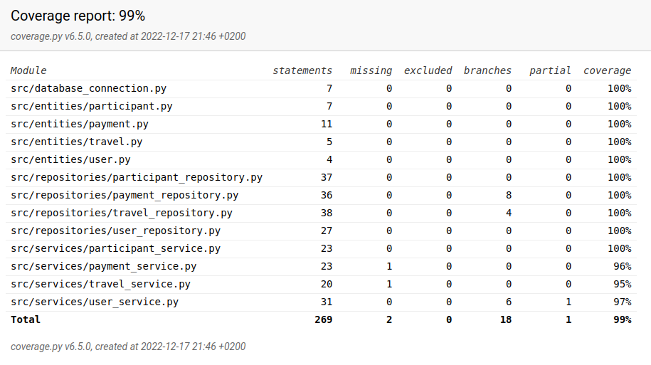

# Testausdokumentti

Ohjelmaa on testattu sekä automatisoiduin yksikkö- ja integraatiotestein unittestilla sekä manuaalisesti tapahtunein järjestelmätason testein.

## Yksikkö- ja integraatiotestaus

### Sovelluslogiikka

Sovelluslogiikasta vastaavia luokkia `UserService`, `TravelService`, `ParticipantService` ja `PaymentService` testataan omilla testiluokilla [TestUserService](https://github.com/phuvio/ot-harjoitustyo/blob/main/travel-expense-calculator-app/src/tests/user_service_test.py), [TestTravelService](https://github.com/phuvio/ot-harjoitustyo/blob/main/travel-expense-calculator-app/src/tests/travel_service_test.py), [TestParticipantService](https://github.com/phuvio/ot-harjoitustyo/blob/main/travel-expense-calculator-app/src/tests/participant_sevice_test.py) ja [TestPaymentService](https://github.com/phuvio/ot-harjoitustyo/blob/main/travel-expense-calculator-app/src/tests/payment_sevice_test.py). Jokainen `Service`-olio alustetaan, niin että sille injektoidaan riippuvuksiksi vastaavat repositorio-oliot, jotka tallentevat tietoa ainoastaan testeissä käytössäolevaan testitietokantaan `test-travelexpenses.db`.

### Repositorio-luokat

Repositorio-luokkia `UserRepository`, `TravelRepository`, `ParticipantRepository` ja `PaymentRepository` testataan ainoastaan testeissä käytössäolevaa testitietokantaa `test-travelexpenses.db` käyttäen. Testitietokannan nimi on konfiguroitu _.env.test_-tiedostoon. Vastaavat testiluokat ovat [TestUserRepository](https://github.com/phuvio/ot-harjoitustyo/blob/main/travel-expense-calculator-app/src/tests/user_repository_test.py), [TestTravelRepository](https://github.com/phuvio/ot-harjoitustyo/blob/main/travel-expense-calculator-app/src/tests/travel_repository_test.py), [TestParticipantRepostiory](https://github.com/phuvio/ot-harjoitustyo/blob/main/travel-expense-calculator-app/src/tests/participant_repository_test.py) ja [TestPaymentRepository](https://github.com/phuvio/ot-harjoitustyo/blob/main/travel-expense-calculator-app/src/tests/payment_repository_test.py).

### Testauskattavuus

Käyttöliittymäkerrosta lukuunottamatta sovelluksen testauksen haarautumakattavuus on 99%

## Järjestelmätestaus

Sovelluksen järjestelmätestaus on suoritettu manuaalisesti.

### Asennus ja konfigurointi

Sovellus on haettu ja sitä on testattu [käyttöohjeen](./kayttoohje.md) kuvaamalla tavalla Linux-ympäristöön. 

Sovellusta on testattu sekä tilanteissa, joissa käyttäjät ja työt tallettavat tiedostot ovat olleet olemassa ja joissa niitä ei ole ollut jolloin ohjelma on luonut ne itse.

### Toiminnallisuudet

Kaikki [määrittelydokumentin](./vaatimusmaarittely.md#perusversion-tarjoama-toiminnallisuus) ja käyttöohjeen listaamat toiminnallisuudet on käyty läpi. Kaikkien toiminnallisuuksien yhteydessä on syötekentät yritetty täyttää myös virheellisillä arvoilla kuten tyhjillä.

## Sovellukseen jääneet laatuongelmat

Sovellus ei anna tällä hetkellä järkeviä virheilmoituksia, seuraavissa tilanteissa:

- Konfiguraation määrittelemiin tiedostoihin ei ole luku/kirjoitusoikeuksia

